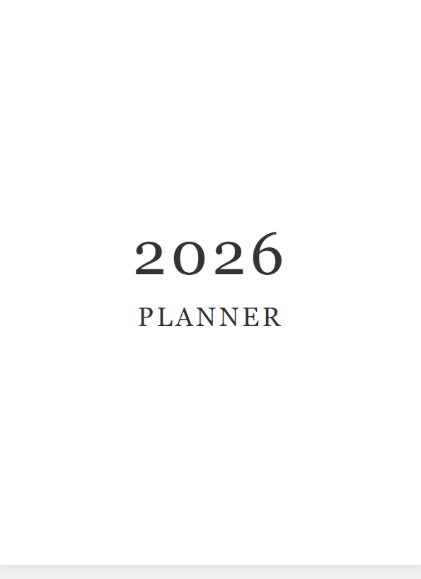
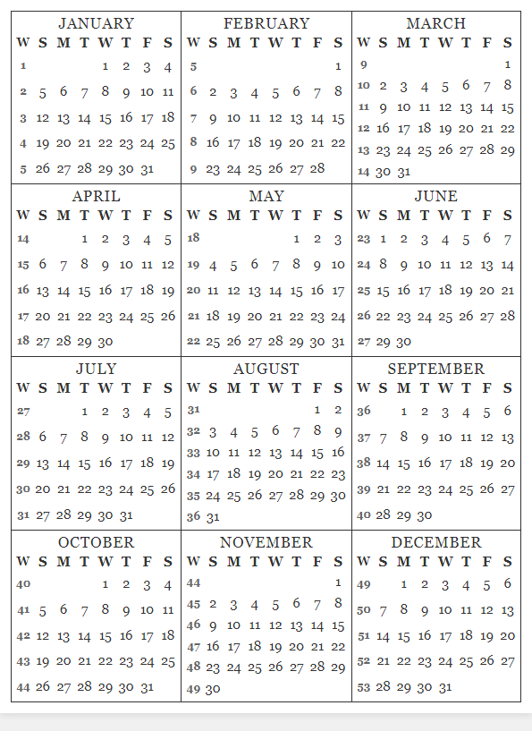
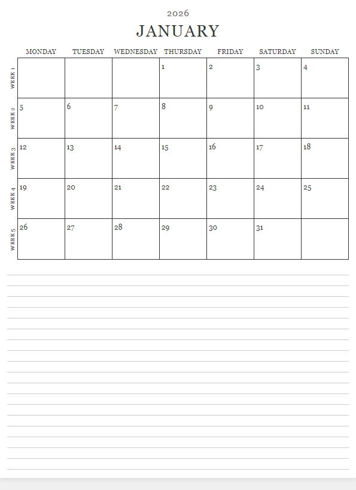
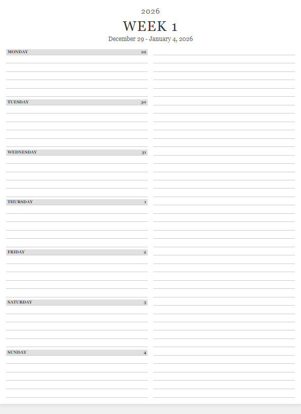

# Yearly Planner Generator

Generate a printable PDF planner optimized for Kindle Scribe (6.2 x 8.3 inches) with yearly overview, monthly pages, and weekly spreads.

## Setup

1. Install dependencies:
```bash
pip install -r requirements.txt
playwright install chromium
```

2. Generate planner:
```bash
python generate_pdf.py
```

The PDF will be created as `2026.pdf` in the output folder.

## Configuration

Edit `config.py` to customize:
- `DEFAULT_YEAR` - Year to generate (default: 2026)
- `PAGE_WIDTH` / `PAGE_HEIGHT` - Page dimensions
- `MONTHLY_NOTES_LINES` / `WEEKLY_LINES_PER_DAY` - Layout options in `constants.py`

## Page Types

### Title Page


### Year Overview


### Monthly Pages


### Weekly Pages


## Features

- **Hyperlinked navigation** - Click dates to jump between pages
- **Kindle Scribe optimized** - Perfect dimensions for digital annotation
